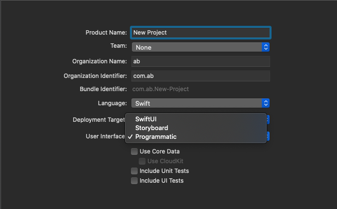
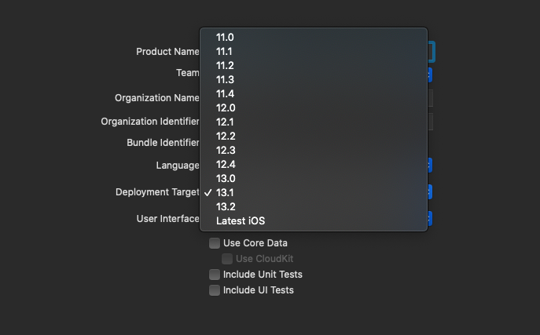
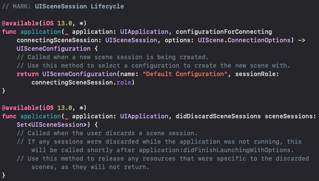
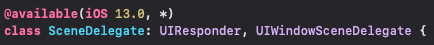
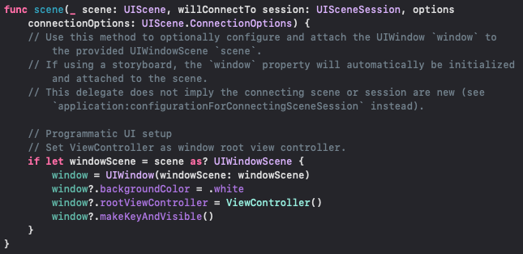
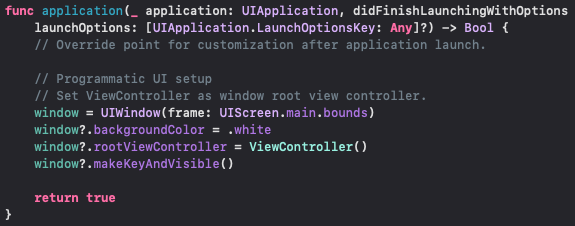
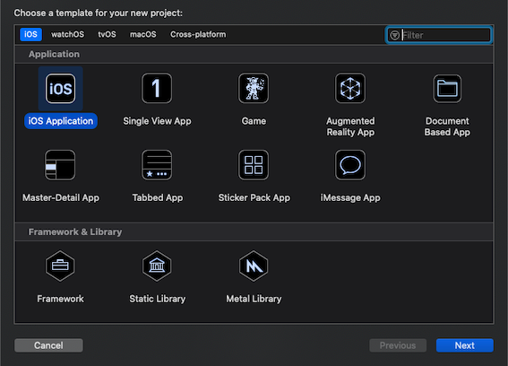

# Xcode-Templates

## Overview
When choosing the minimum iOS version to support, usually developers rely on "current minus one" or "current minus two" depending on the user base. Ever since Apple introduced multi-window feature in iOS 13.0 everytime I created a new Xcode project and changed the minimum iOS version (deployment target) to iOS 12.4 or lower, I would get error messages when trying to compile. 

I was looking for a template that would handle these errors for me but could not find any. So I decided to create a template that would take care of these errors.

## Features
Currently there's only one project template. I plan on adding more features/templates.

*   ### iOS Application
    * Select user interface (SwiftUI or Storyboard or Programmatic).
        
        
    * Select deployment target (iOS 11.0 to iOS 13.2 (Latest iOS)) before creating a project.
        
        
        **Note: The iOS versions are hardcoded. Choosing the Latest iOS selects the latest iOS version.**
        
    * If deployment target is < iOS 13.0, adds @available attribute for methods and classes available in iOS 13.0.
        `AppDelegate.swift`
        
        
        `SceneDelegate.swift`
        
        
    * If user interface is "Programmatic", then `window` property is initialized with a frame and `rootViewController` is set to `ViewController`.
        
        
    * If user interface is "Programmatic" and deployment target is < iOS 13.0 then `window` property is initialised in `AppDelegate.swift` as well.
        

**Note: This template was primarily made for Swift projects. Some features may not reflect in Objective-C projects.**
    

## Installation
1. Open Terminal
    ```
    git clone https://github.com/ashutoshbilla/xcode-templates
    cd xcode-templates
    ./install.sh
    ```
    Feel free to delete the `xcode-templates` directory.
2. Open Xcode and select create a new Xcode Project. You'll see a new template in the "Applications" category under iOS.




##### Thanks to [this great blog post](https://useyourloaf.com/blog/creating-custom-xcode-project-templates/) I was able to make this template. Apple's own templates also helped me understand and create my own templates.

Apple's iOS templates can be found at 
`/Applications/Xcode.app/Contents/Developer/Platforms/iPhoneOS.platform/Developer/Library/Xcode/Templates/Project Templates`

